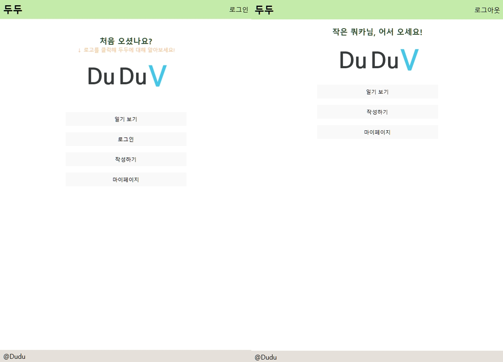
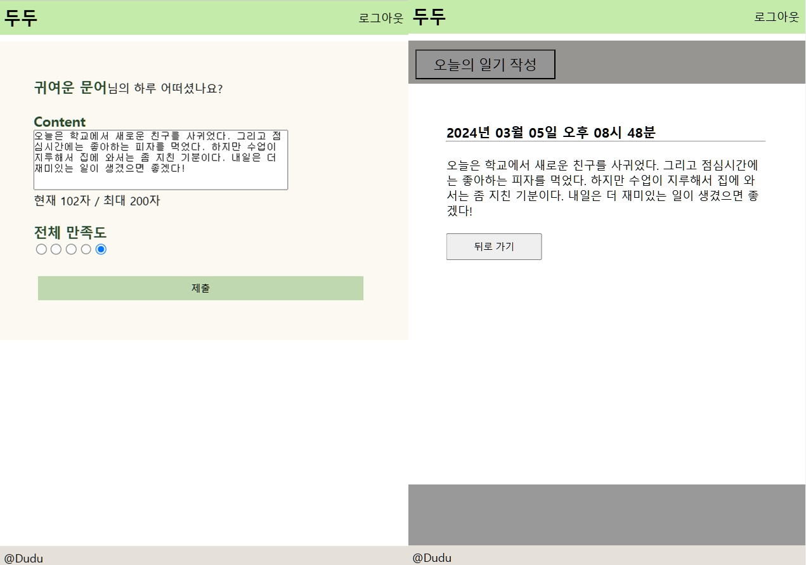
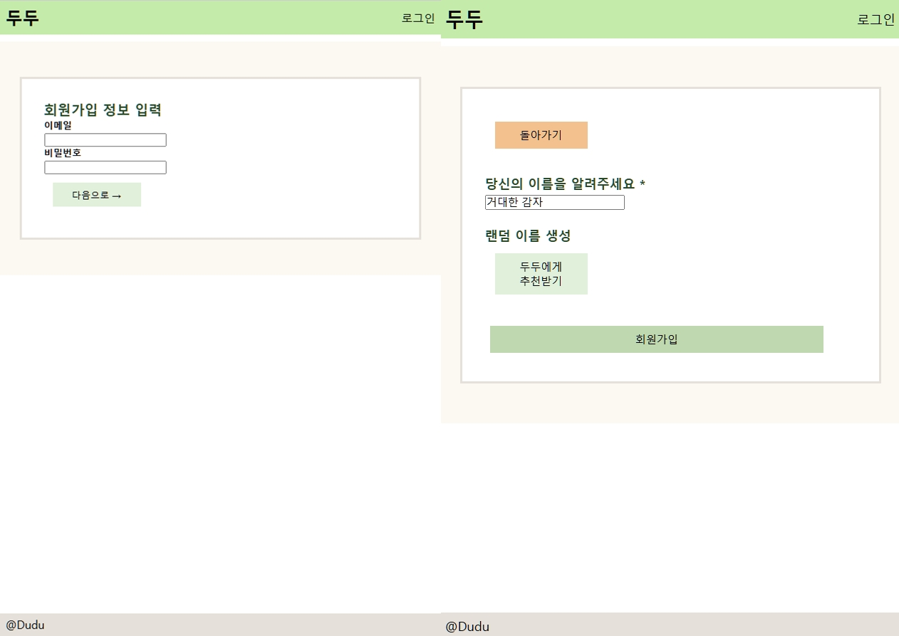
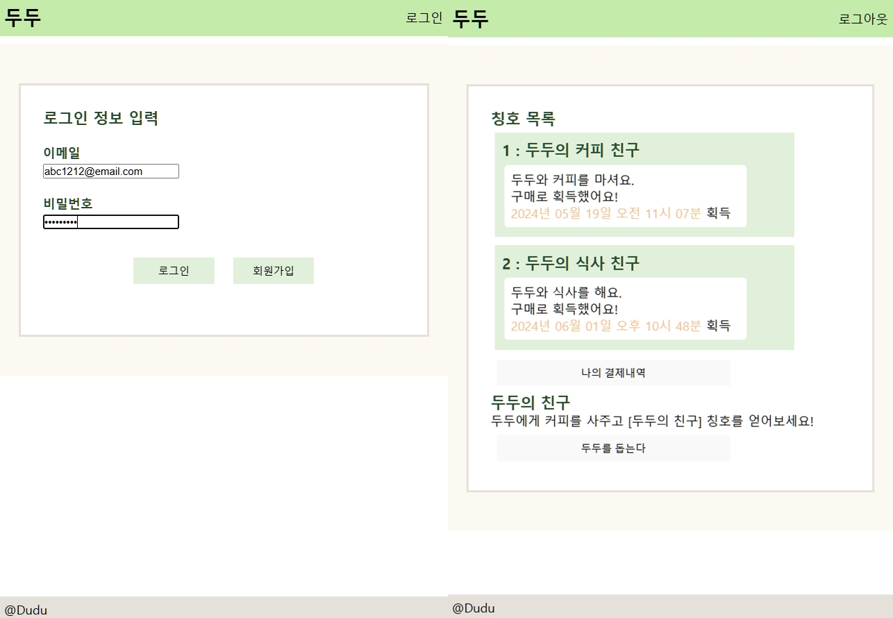
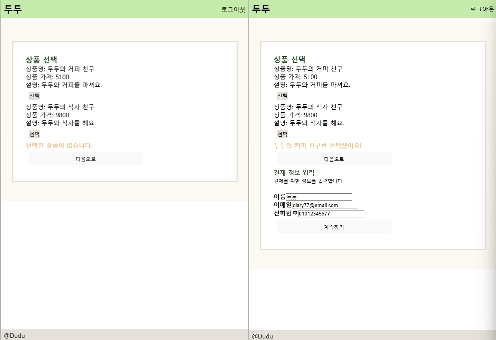
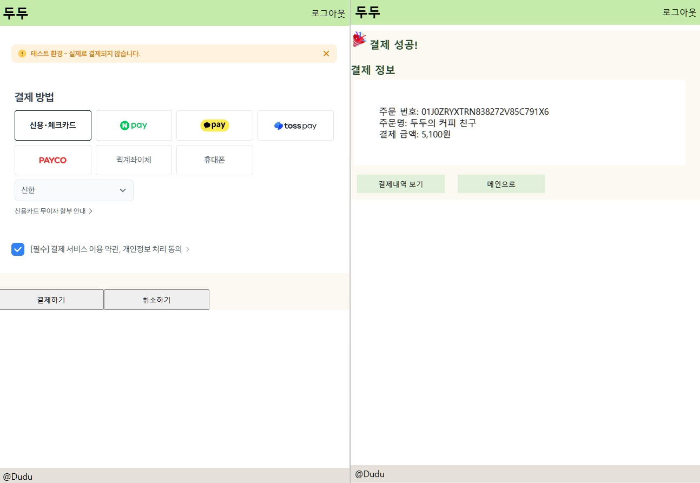
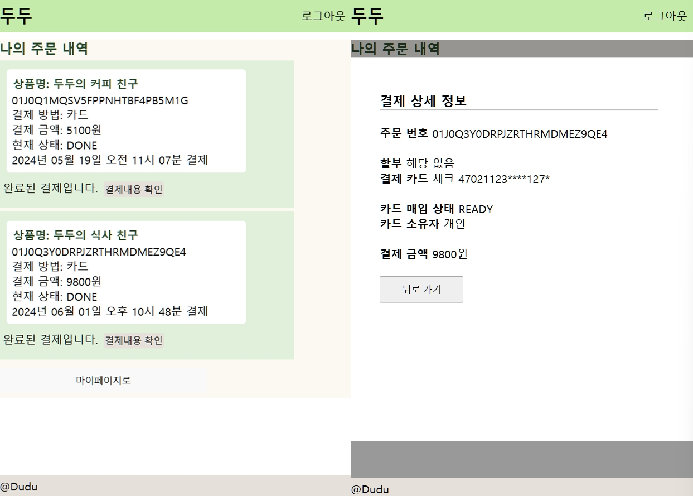

# ✏️ 두두 일기장

## 개요

- 개인 프로젝트
- 프론트엔드, 백엔드, AI 서버로 구성

### 주제

사용자가 입력한 일기를 요약 모델을 활용하여 간략하게 표시해주는 서비스입니다.
 일기 서비스에 사용자의 흥미를 유발하기 위한 AI 텍스트 분석 기능을 추가했습니다.

### 주요 기능
   
#### **인증(jwt)**
   - jwt 토큰을 이용한 인증 과정 구현
   
#### **일기**
   - 일기 생성, 조회, 삭제
   - 시간이 걸리는 일기 내용 요약을 비동기적으로 처리
      - BullMQ 라이브러리, Redis 저장소를 활용한 메세지 큐 구현
   
#### **결제 처리, 주문**
   - 사용자에게 Customer Key를 발급하고 관리함
   - Customer key, Secret key 등 결제에 필요한 정보를 서버에서 조회
   - 주문 내역(ORDER) 저장 및 조회

---

## 기술 스택

#### 공통

#### FRONT

   

   

#### BACK

  

 

#### AI Server

> \* 활용한 모델 
> 출처 : https://huggingface.co/psyche/KoT5-summarization

 

## 구현 화면

## 주요 기능

#### 일기 작성

- 작성한 일기 조회
- 일기 작성 및 삭제
- 모델을 통해 요약한 결과 표시

#### 회원 기능

- 회원가입, 로그인
- 리프레시 토큰을 사용하여 로그인 유지

#### 칭호

- 결제를 통해 칭호 획득
- 칭호 설명, 유저의 획득일자 조회(inner join)

#### 결제

- 상품에 따른 결제 가능
- 주문 내역 조회
- 결제 수단(가상 계좌, 카드) 조회

\* toss payments API를 활용했습니다.

#### TitleModule

